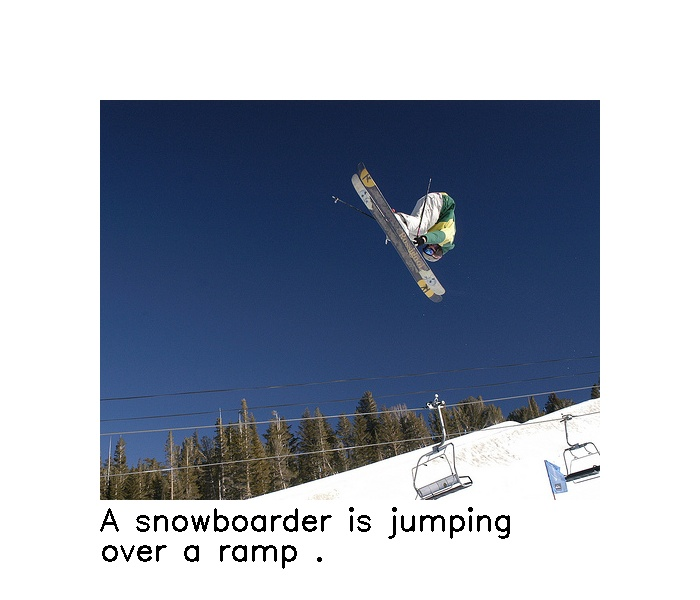
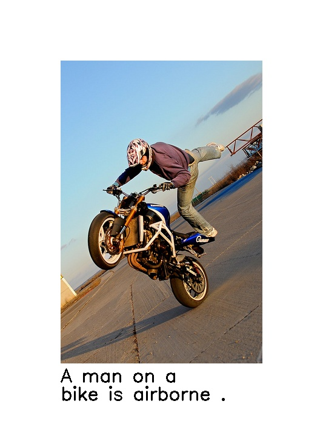
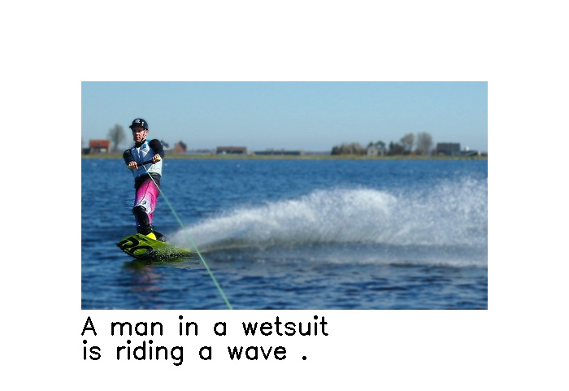
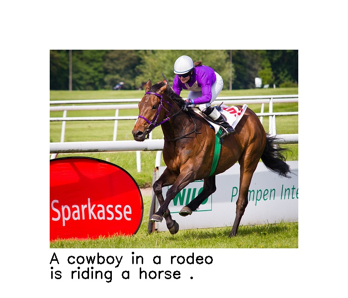
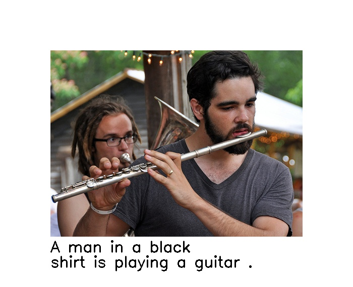
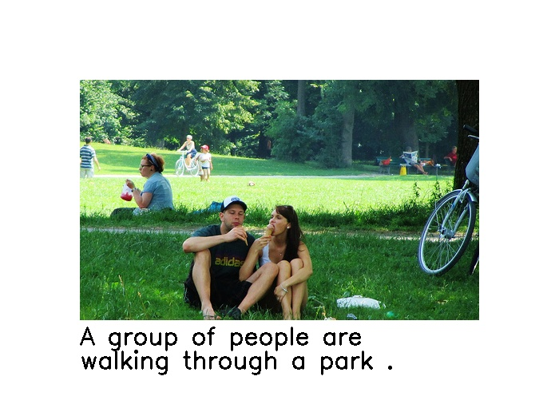
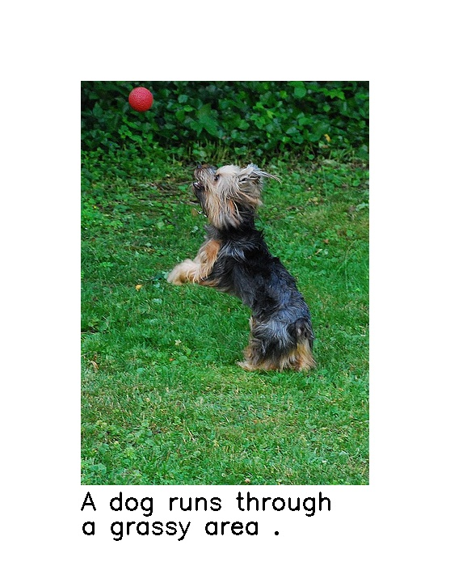
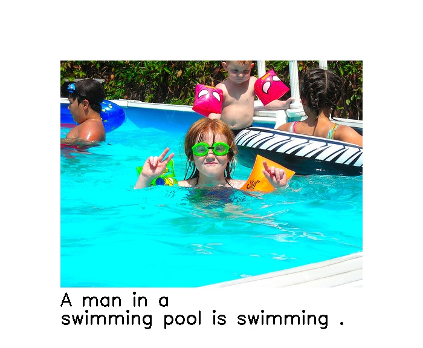

<div align="center">
<h2>Image Captioning in PyTorch</h2>
</div>


### Description
This project implements a Image Captioning model based on the [Show and Tell](https://arxiv.org/abs/1411.4555) paper. It uses the [Flickr30k](https://www.kaggle.com/hsankesara/flickr-image-dataset) dataset for training of the model. This is not a strict paper implementation, it's based on the ideas from paper, I experimented with few things and also used different optimizer and learning rate scheduler. Also, I didn't find the official train/test split for this data, therefore I use 29,000 images as training and rest as validation set. The results are comparable to the paper. It achieves 86.87% Bleu-4 score.

### Requirements
* python >= 3.7
* pytorch >= 1.0
* pytorch_lightning >= 0.7.6
* nltk  >= 3.5

### How To Use
Download additional files (preprocessed training features, pretrained model) from [this](https://drive.google.com/drive/folders/1uUqVk-XXTviQsTpSlZ79gtzEKMIdZqWC?usp=sharing) link. Download the train_features.pkl and place it in data directory.
To train the model, run
```
$ python ic_trainer.py
```
To use the model on an image, run
```
$ python predict.py --model /path/to/model_checkpoint.ckpt --path /path/to/image.jpg --save
```
Trained model (checkpoint.ckpt) is available at above link.

### Methodology
The model uses an Imagenet pretrained Resnet50 as the backbone encoder and a 3 layer stacked LSTM as the decoder. To reduce the training time, output of Resnet50 backbone was calculated and stored for all images. BPTT is done for 85 timesteps. Adam optimizer with Cosine Annealing Learning Rate Scheduler is used to train the model for 20 epochs.

### Analysis and Results
Here is a list of things I tried:
* Finetuning the backbone during training: It did not have any drastic improvements in results.
* Pretrained GLOVE Embeddings: I tried using the 300 dimensional GLOVE embeddings. They yielded similar results and therefore I decided not to include it.
* Embedding Dropout: This reduced the quality of captions generated, therefore disacarded.
* Initializng hidden and cell state of LSTM with output of encoder: This yielded similar results, therefore discarded.
* Hidden layer after Encoder and hidden layer after LSTM: This proved to be very useful in improving the results. A hidden layer after encoder and a hidden layer after LSTM are very important. Removing this reduces the BLEU metric and hence reducing the quality of captions generated.
* Dropout and BatchNorm for Hidden Layers and LSTM: Dropout and Batchnorm proved to be very useful in preventing the model from overfitting.
* Bigger batch size: This helped to increase the BLEU metric without any additional modifications. 

Here are some results from the validation set:










